# 🏗️ System Architecture Flow Diagram

## 📋 Overview

This document provides comprehensive flow diagrams showing how data flows through the OrderFlow Trading System, from market data ingestion to signal generation and client delivery.

## 🌊 High-Level Data Flow


## 🔄 Detailed Processing Pipeline

### Data Ingestion & Preprocessing


### Pattern Detection Architecture

```mermaid
graph TD
    subgraph "Event-Based Detectors"
        A1[AbsorptionDetector<br/>O(n·z)]
        A2[ExhaustionDetector<br/>O(n·m)]
        A3[DeltaCVDConfirmation<br/>O(w·n·log n)]
    end

    subgraph "Service Detectors"
        B1[IcebergDetector<br/>O(c·p²)]
        B2[SpoofingDetector<br/>O(b·h·p)]
        B3[HiddenOrderDetector<br/>O(1)]
    end

    subgraph "Zone-Based Detectors"
        C1[AccumulationZoneDetector<br/>O(z·s)]
        C2[DistributionZoneDetector<br/>O(z·s)]
    end

    D[EnrichedTradeEvent] --> A1
    D --> A2
    D --> A3
    D --> B1
    D --> B2
    D --> B3
    D --> C1
    D --> C2

    A1 --> E[SignalCoordinator]
    A2 --> E
    A3 --> E
    B1 --> F[AnomalyDetector]
    B2 --> F
    B3 --> F
    C1 --> G[ZoneManager]
    C2 --> G

    E --> H[SignalManager]
    F --> H
    G --> H
```

### Signal Processing & Delivery


## 🧵 Worker Thread Communication


## 🔍 Detector-Specific Flow Patterns

### AbsorptionDetector - Zone Processing

```mermaid
graph TD
    A[Trade Event] --> B[Zone Calculation O(1)]
    B --> C[Zone Lookup O(1)]
    C --> D[Current Window Update O(1)]
    D --> E[Zone Iteration O(z)]
    E --> F[Price Efficiency Analysis]
    F --> G[Volume Surge Detection]
    G --> H[Passive Volume Tracking]
    H --> I{Absorption Threshold Check}
    I -->|Pass| J[Signal Generation]
    I -->|Fail| K[Continue Processing]
    J --> L[Confidence Scoring]
    L --> M[Zone State Update]
```

### DeltaCVDConfirmation - Multi-Window Analysis

```mermaid
graph TD
    A[Trade Event] --> B[Window Distribution O(w)]
    B --> C1[60s Window CVD]
    B --> C2[300s Window CVD]
    B --> C3[900s Window CVD]
    C1 --> D1[Z-Score Calculation]
    C2 --> D2[Z-Score Calculation]
    C3 --> D3[Z-Score Calculation]
    D1 --> E[Signal Synthesis]
    D2 --> E
    D3 --> E
    E --> F[Price Correlation Analysis]
    F --> G[Passive Volume Enhancement]
    G --> H{Multi-Window Validation}
    H -->|Pass| I[Confidence Scoring]
    H -->|Fail| J[Continue Processing]
```

### IcebergDetector - Pattern Recognition

```mermaid
graph TD
    A[Trade Event] --> B[Candidate Detection]
    B --> C{Existing Candidate?}
    C -->|Yes| D[Update Candidate]
    C -->|No| E[Create New Candidate]
    D --> F[Pattern Analysis O(p)]
    E --> G[Size Validation]
    G --> F
    F --> H[Confidence Calculation]
    H --> I{Qualification Check}
    I -->|Pass| J[Iceberg Signal]
    I -->|Fail| K[Continue Tracking]
    J --> L[LRU Cleanup]
    K --> M[Periodic Cleanup]
```

## 📊 Performance Monitoring Points

### Critical Measurement Points

```mermaid
graph LR
    subgraph "Latency Monitoring"
        A1[WebSocket → Preprocessor]
        A2[Preprocessor → Detectors]
        A3[Detectors → SignalManager]
        A4[SignalManager → Clients]
    end

    subgraph "Throughput Monitoring"
        B1[Trades/Second Processing]
        B2[Signals/Second Generation]
        B3[Client Messages/Second]
    end

    subgraph "Resource Monitoring"
        C1[Memory Usage per Detector]
        C2[CPU Usage per Thread]
        C3[Queue Depth Monitoring]
    end

    A1 --> D[Performance Dashboard]
    A2 --> D
    A3 --> D
    A4 --> D
    B1 --> D
    B2 --> D
    B3 --> D
    C1 --> D
    C2 --> D
    C3 --> D
```



## 🚨 Error Handling & Recovery Flow


## 🎯 Configuration Flow


## 📈 Scaling Architecture


---

## 🔗 Related Documentation

- **[Algorithm Complexity Analysis](./Algorithm-Complexity-Analysis.md)** - Detailed complexity analysis for all detectors
- **[Worker Thread Isolation Architecture](./Worker-Thread-Isolation-Architecture.md)** - Worker thread communication patterns
- **[Zone-Based Architecture](./Zone-Based-Architecture.md)** - Zone-based detector architecture
- **[Storage System Architecture](./Storage-System-Architecture.md)** - Data persistence patterns

**This architecture documentation provides the foundation for system optimization, troubleshooting, and scaling decisions in the institutional trading environment.**
